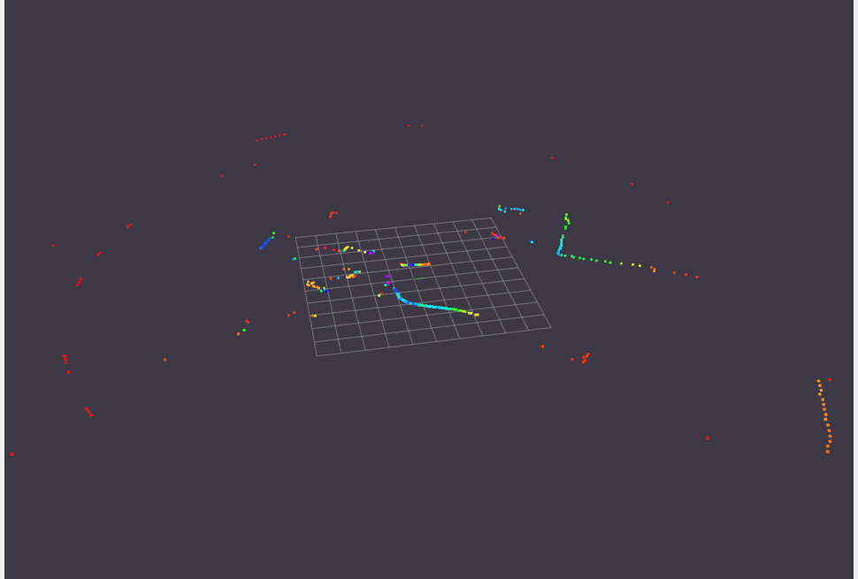

# Based on

[ForteFibre/ros2_mini360_lidar](https://github.com/ForteFibre/ros2_mini360_lidar)

## Setup

Requirements:
- ROS2 Humble
- USB permissions

Clone the repository into the workspace:

```sh
cd ~/ros2_ws/src
git clone <repository url>
cd ~/ros2_ws
colcon build --symlink-install --packages-select mini360_lidar
source ~/ros2_ws/install/setup.bash
ros2 run mini360_lidar mini360_lidar_node
```

## Results




